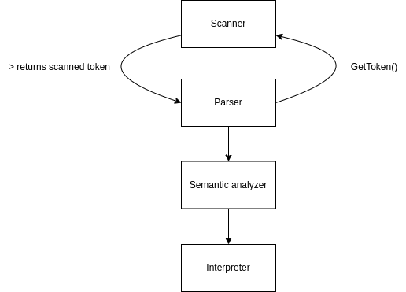
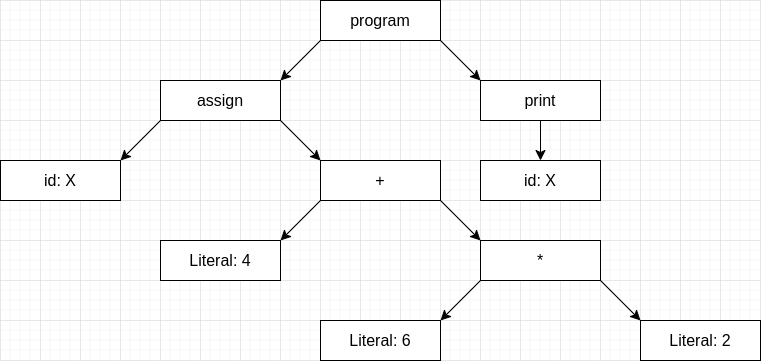
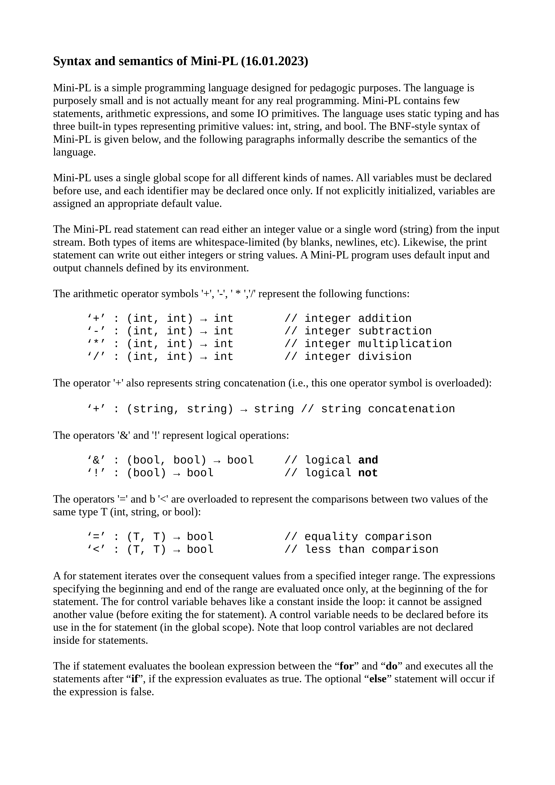
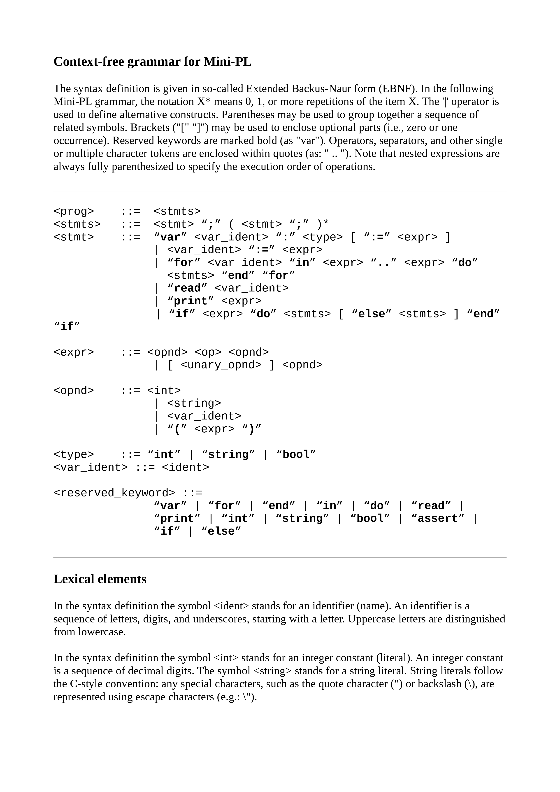
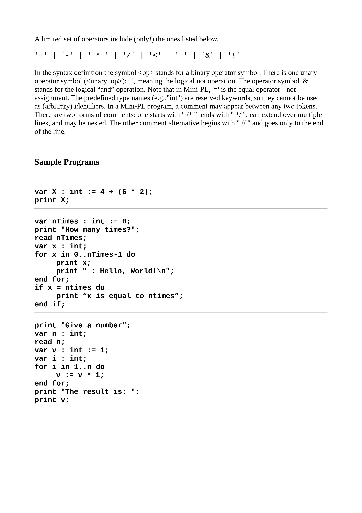

# MPL Interpreter
## Overview

Install .NET 7.

Build & run:

(cd src/mpl-interpreter/ && dotnet run ../../examples/sourcecode.mpl)

Graphical overview of the architecture:



The interpreter begins with an instance of a parser
that has the scanner in the constructor which was the source file given
in the constructor. AST is generated in the parser token by token that
are fetched from the scanner given in the constructor of the parser.
Scanner scans the next token and gives the appropriate guessed type and
value as a C# Tuple for the parser. Semantic analyzer then analyzes the
AST in one go. The AST is then given to interpreter which interprets and
executes the code.

Run tests:

(cd test/mpl-interpreterTests/ && dotnet test)

ScannerTests have an unit test for generating the list of tuples which
is given to parser. Now that the testing suite is configured it would be
best to create integration tests for parser, semantic analyzer and
interpreter as each of those could be then tested for broken
interoperability between new changes to components. The tests are also
part of the CI/CD workflow the code repository in GitHub:
<https://github.com/akirataguchi115/mpl-interpreter> . This way the
tests fail automatically with every push if for example the new changes
break some components and their communication together.

The project has shortcomings in multiple modules. CFG and AST are not
documented here. Interpreting, code generation, parsing and semantic
analysis are not present in the code. Scanner does not cover all of the
tokens and very easily gives an "identifier" type for a token. Numbers
and ranges are not implemented in the code and the code would require a
rewrite on the switch case part to make for example the numbers
tokenizable. There are no integration tests for parser, semantic
analyzer or code generation which would have been most useful as they
are the most dependent of other modules i.e. they would break more
easily. Scanner recognizes the ";" character as part of the token it is
next to if it's there without a space. There are more shortcomings of
the project and it's implementations but most of them consist of just
the lack of implementation.

## Token patterns

Regular expression for recognizing type tokens:

/\\wint\|string\|bool\|/g

Regular expression for recognizing null tokens:

/\\wvar\|\\:\|\\:=\|\\-\|\\;\\g

Regular expression for recognizing error tokens:

/\\"\\n"\\g

## CFG

EBNF of the CGF eliminated from LL(1) violations (GPT-3 was used to construct this from the original EBNF):

```
<prog> ::= <stmts> EOF
<stmts> ::= <stmt> ";" <stmts'> 
<stmts'> ::= <stmt> ";" <stmts'> | ε
<stmt> ::= "var" <var_ident> ":" <type> <stmt''>
| <var_ident> ":=" <expr>
| "for" <var_ident> "in" <expr> ".." <expr> "do" <stmts> "end" "for"
| "read" <var_ident>
| "print" <expr>
| "if" <expr> "do" <stmts> <stmt'>
<stmt'> ::= "else" <stmts> "end" | "end"
<stmt''> ::= ":=" <expr> | ε
<expr> ::= <opnd> <op> <opnd>
| <unary_opnd> <opnd'>
<opnd'> ::= <op> <opnd> | ε
<opnd> ::= <int>
| <string>
| <var_ident>
| "(" <expr> ")"
<type> ::= "int" | "string" | "bool"
<var_ident> ::= <ident>
<ident> ::= <letter> { <letter> | <digit> | "_" }
<letter> ::= "a" | "b" | ... | "z" | "A" | "B" | ... | "Z"
<digit> ::= "0" | "1" | ... | "9"
<op> ::= "+" | "-" | "*" | "/" | "==" | "!=" | "<" | ">" | "<=" | ">="
<unary_opnd> ::= "-" | "not"
<reserved_keyword> ::= "var" | "for" | "end" | "in" | "do" | "read" | "print" | "int" | "string" | "bool" | "assert" | "if" | "else"
EOF ::= "$"

Note: "ε" represents an empty string or no production.
```

## AST

AST from the sample program 1:


## Error handling

Parser, semantic analyzer and interpreter can all raise errors where as
scanner can only tag the returned tuple as an error token. Parser will
raise an error when given this error token for instance. Semantic
analyzer will raise an error if the tokens orders don't make sense.
Interpreter will raise an error with runtime errors.



